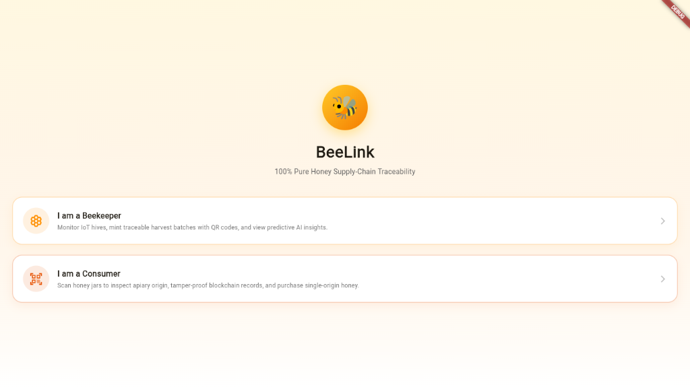
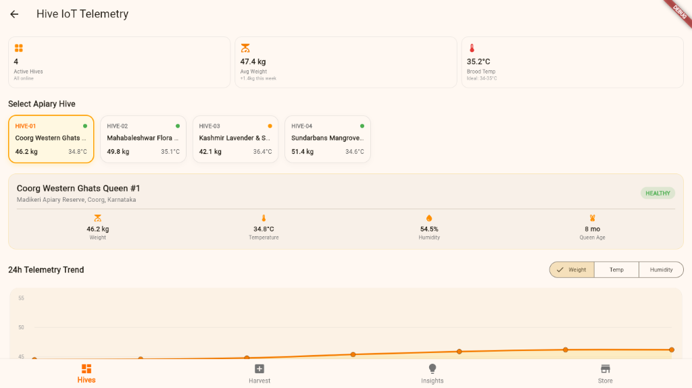
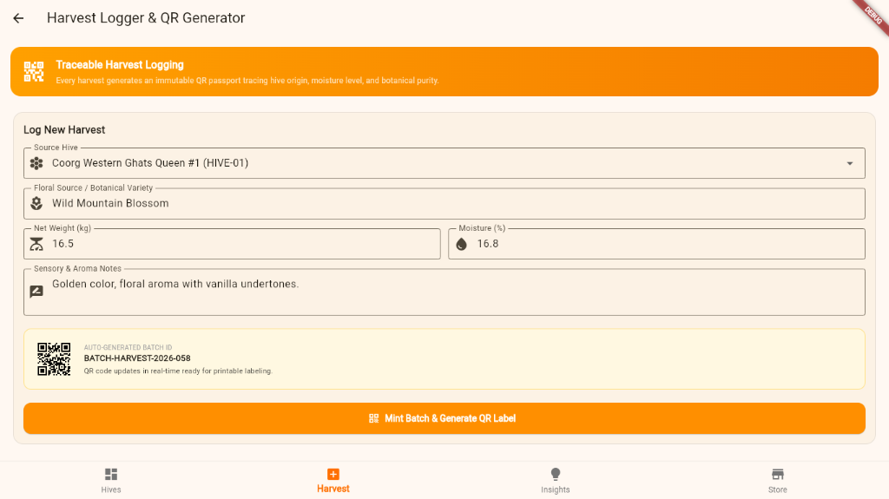
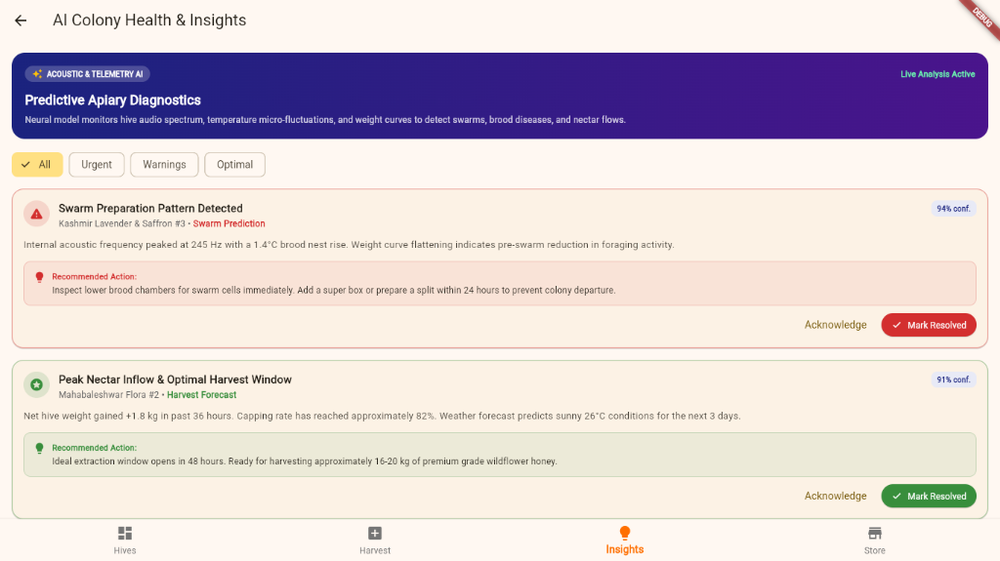
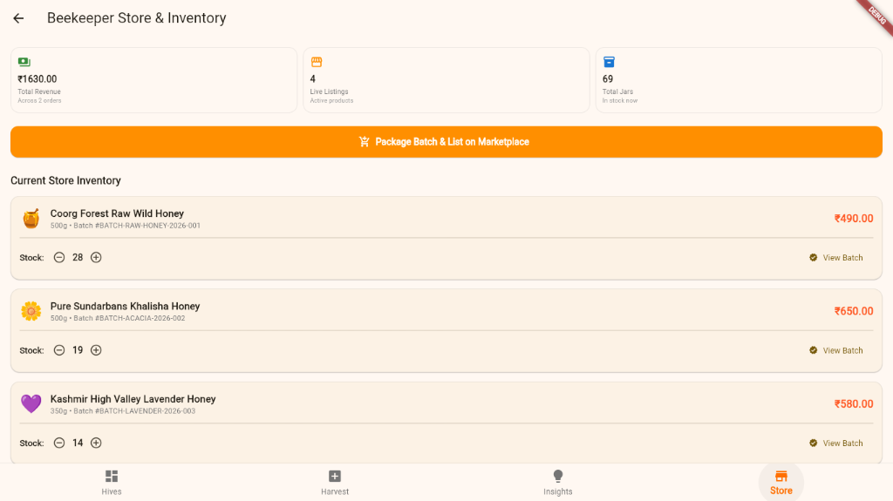
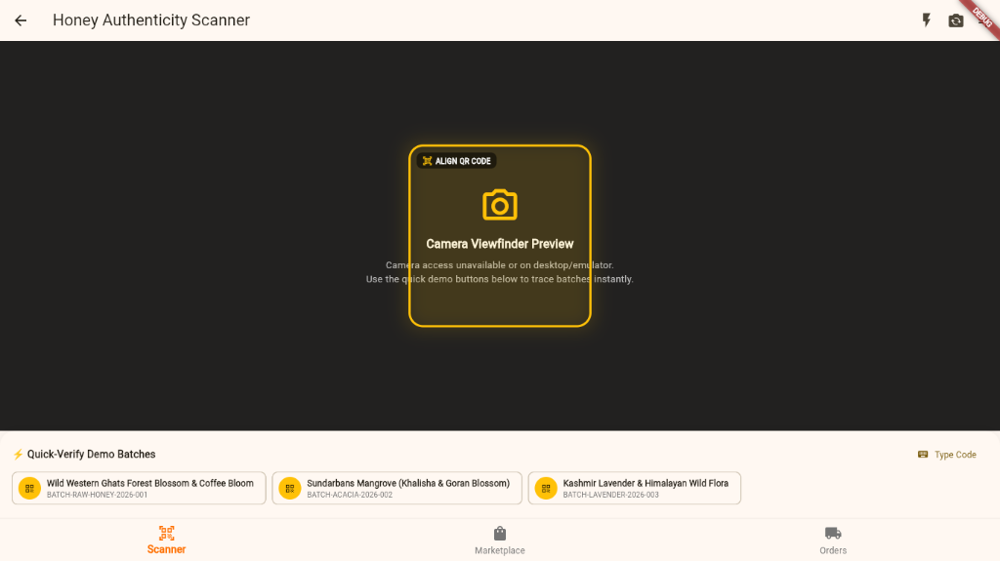
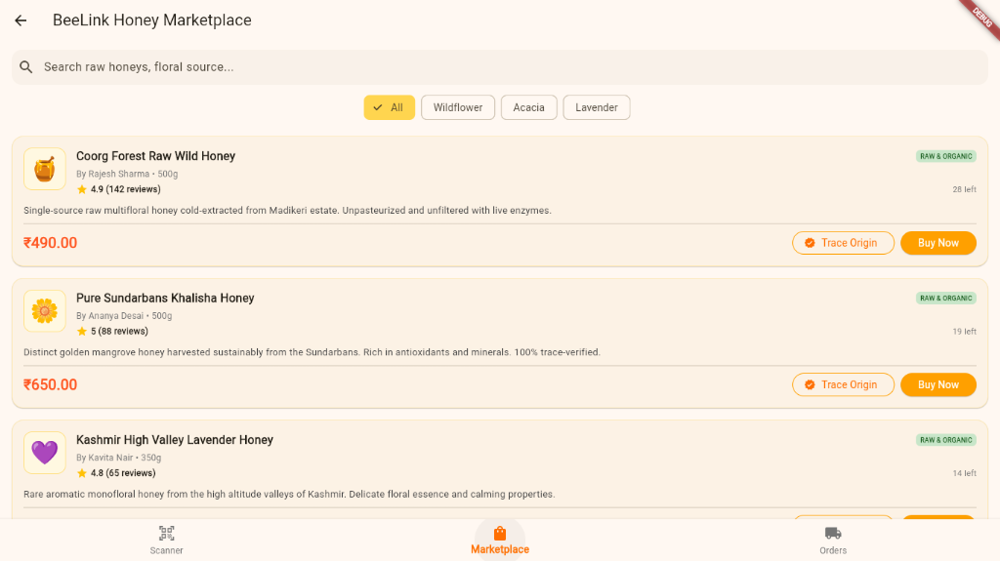
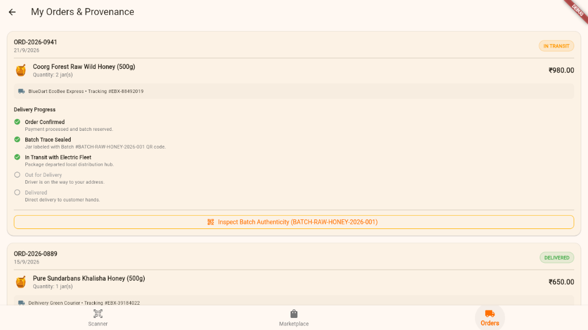

# 🍯 BeeLink — Honey Supply Chain Traceability & Smart Beekeeping

[](https://flutter.dev)
[](https://dart.dev)
[](LICENSE)
[](#)

**BeeLink** is a next-generation honey supply-chain traceability and smart apiary management platform built with Flutter. It connects beekeepers and conscious consumers through IoT-assisted hive telemetry, verifiable harvest provenance, and QR-powered batch tracking.

---

## 📌 Problem Statement

1. **Widespread Honey Adulteration & Fraud**: Honey is one of the most counterfeited foods worldwide. Cheap syrups, artificial sugars, and origin masking make it difficult for consumers to verify authentic, raw honey.
2. **Opaque Supply Chains**: Traditional supply chains hide the origins of the honey. Consumers have no way of knowing the harvest date, apiary location, floral nectar source, or beekeeper practices.
3. **Beekeeper Disintermediation**: Artisan beekeepers often lack direct access to consumers, relying on middlemen who squeeze profit margins and blend pure batches with industrial syrups.
4. **Lack of Modern Apiary Tools**: Beekeepers need real-time data on hive health (weight changes, internal hive temperature, humidity, swarm detection) to prevent colony collapse and optimize harvest timings.

---

## 💡 The BeeLink Solution

BeeLink delivers a trustless, transparent ecosystem with dual dedicated user experiences:

```
[ Smart Apiary / Hive Sensors ]
             │
             ▼
   [ Beekeeper Portal ]
   ├── Real-Time Telemetry Dashboard (Weight, Temp, Humidity)
   ├── AI Health & Swarm Predictive Insights
   ├── Digital Harvest Logger & QR Generator
   └── Direct Artisan Store & Stock Manager
             │
      (QR Batch Code)
             │
             ▼
    [ Consumer Portal ]
    ├── Camera QR Scanner for Jars
    ├── Hive-to-Jar Provenance & Lab Test Viewer
    ├── Direct Artisan Honey Marketplace
    └── Climate-Controlled Order Tracking
```

---

## ✨ Key Features

### 🐝 Beekeeper Portal
- **Hive Telemetry Dashboard**: Live monitoring of hive weight, internal temperature, relative humidity, and queen age, with interactive historical trend charts.
- **AI-Powered Insights**: Automated health diagnostics predicting optimal harvest windows, swarm risks, moisture anomalies, and varroa mite alerts.
- **Harvest Logger**: Standardized digital logging of harvests (nectar source, moisture percentage, origin ratings, yield) with automatic batch identification.
- **QR Code Generation**: Instantly generates vector QR codes for every batch to attach to jar packaging.
- **Inventory & Store Management**: List artisan honey jars directly on the integrated marketplace, control stock, and set transparent pricing.

### 🍯 Consumer Portal
- **Instant QR Provenance Scanner**: Scan any BeeLink batch code or bottle label to instantly unlock the honey's full provenance journey.
- **Interactive Batch Details**: View verified origin, moisture content, floral nectar source, apiary geolocation, and harvest date.
- **Artisan Marketplace**: Discover and purchase raw, unfiltered, single-origin honey directly from verified beekeepers.
- **End-to-End Order Tracking**: Track the order through cold-storage packing, climate-controlled electric vehicle dispatch, and delivery.

---

## 📸 Screenshots & Visual Walkthrough

### 🔀 Role Selection Screen
Dual-portal gateway allowing users to seamlessly toggle between the **Beekeeper** and **Conscious Consumer** workflows.

<p align="center">
  
</p>

### 🐝 Beekeeper Portal

#### 1. Hive IoT Telemetry Dashboard
Real-time sensor telemetry tracking hive weight, internal brood temperature, humidity, and queen health alongside 24-hour historical trend charts across all active apiaries.

<p align="center">
  
</p>

#### 2. Harvest Logger & QR Generator
Digitized harvest logging capturing botanical floral source, moisture percentages, sensory notes, and auto-minting traceable QR batch passports.

<p align="center">
  
</p>

#### 3. AI Colony Health & Predictive Insights
Acoustic spectrum diagnostics and weight curve analytics detecting swarm preparation patterns and predicting optimal extraction windows before colony loss.

<p align="center">
  
</p>

#### 4. Beekeeper Store & Inventory Management
Integrated direct-to-consumer store manager allowing beekeepers to package harvest batches, set jar pricing, track inventory stock, and monitor total sales revenue.

<p align="center">
  
</p>

### 🍯 Consumer Portal

#### 1. Honey Authenticity QR Scanner
Camera viewfinder interface equipped with instant mock batch verification chips, enabling consumers to inspect honey provenance even without physical labels on emulators.

<p align="center">
  
</p>

#### 2. Direct Artisan Honey Marketplace
Single-origin honey catalog displaying raw, organic certifications, user ratings, real-time jar availability, floral filtering, and direct links to inspect source apiaries.

<p align="center">
  
</p>

#### 3. Orders & Provenance Tracking
Transparent end-to-end milestone tracker following orders from cold-storage batch sealing through green electric vehicle courier dispatch, complete with one-tap batch authentication.

<p align="center">
  
</p>

---

## 🛠️ Tech Stack

- **Framework**: [Flutter](https://flutter.dev) (v3.x) & [Dart](https://dart.dev) (v3.2+)
- **State Management**: Reactive Repository / `ChangeNotifier` pattern ([BeeLinkRepository](lib/mock_data/beelink_repository.dart))
- **Charts & Telemetry**: [`fl_chart`](https://pub.dev/packages/fl_chart) for real-time hive weight and telemetry data
- **QR Code Generation**: [`qr_flutter`](https://pub.dev/packages/qr_flutter) for vector-rendered batch labels
- **QR Scanner**: [`mobile_scanner`](https://pub.dev/packages/mobile_scanner) for native camera barcode recognition
- **Design System**: Honey-themed glassmorphism, responsive Material 3 components, and Cupertino icons

---

## 📂 Project Structure

```
beelink/
├── lib/
│   ├── main.dart                          # Application entry point & theme setup
│   ├── mock_data/
│   │   └── beelink_repository.dart        # Central data repository & state store
│   ├── models/
│   │   ├── ai_insight_model.dart          # AI anomaly & health alert models
│   │   ├── batch_model.dart               # Harvest batch & lab metrics model
│   │   ├── hive_model.dart                # Hive sensor & telemetry model
│   │   ├── order_model.dart               # Order lifecycle & tracking model
│   │   └── product_model.dart             # Marketplace product listing model
│   ├── screens/
│   │   ├── role_selection_screen.dart     # Entry screen to choose role
│   │   ├── beekeeper/
│   │   │   ├── beekeeper_main.dart        # Beekeeper tab navigation shell
│   │   │   ├── hive_dashboard_screen.dart # Live hive telemetry & metrics
│   │   │   ├── harvest_logger_screen.dart # Harvest logger & QR label generator
│   │   │   ├── store_screen.dart          # Product catalog & stock manager
│   │   │   └── ai_insights_screen.dart    # AI hive diagnostics & alerts
│   │   └── consumer/
│   │       ├── consumer_main.dart         # Consumer tab navigation shell
│   │       ├── marketplace_screen.dart    # Artisan honey storefront
│   │       ├── qr_scanner_screen.dart     # Camera QR scanner & manual lookup
│   │       ├── batch_details_screen.dart  # Detailed hive provenance & lab data
│   │       └── order_tracking_screen.dart # Order status & shipping milestones
│   └── widgets/                           # Reusable UI cards, badges & charts
├── test/
│   └── widget_test.dart                   # Smoke and widget tests
├── pubspec.yaml                           # Project dependencies and assets
└── README.md                              # Project documentation
```

---

## 🚀 Getting Started & Setup

### Prerequisites

Ensure you have the following installed on your machine:
- **[Flutter SDK](https://docs.flutter.dev/get-started/install)** (`>= 3.2.0`)
- **[Dart SDK](https://dart.dev/get-dart)** (included with Flutter)
- An IDE with Flutter plugins: **VS Code**, **Android Studio**, or **IntelliJ**
- A target device: Android emulator, iOS simulator, physical phone, or Chrome for Web

Verify your Flutter environment:
```bash
flutter doctor
```

---

### Installation Steps

1. **Clone the repository**:
   ```bash
   git clone https://github.com/k-s-d-s/Beelink.git
   cd Beelink
   ```

2. **Install project dependencies**:
   ```bash
   flutter pub get
   ```

3. **Run the application**:
   - **Chrome (Web)**:
     ```bash
     flutter run -d chrome
     ```
   - **Android / iOS Device**:
     ```bash
     flutter run
     ```

4. **Run Unit & Widget Tests**:
   ```bash
   flutter test
   ```

---

## 🧪 Testing the Traceability Flow

To test the end-to-end QR provenance flow without a physical camera:
1. Open the app and select **Beekeeper** mode.
2. Navigate to **Harvest Logger** and select any batch (e.g., `BATCH-2026-A1`) to view its generated QR code.
3. Switch to **Consumer** mode via the role switcher.
4. Navigate to the **Scan QR** tab. You can use the mock batch selector buttons (e.g. `BATCH-2026-A1`, `BATCH-2026-B3`) to simulate scanning and view the full provenance breakdown.

---

## 📄 License

This project is licensed under the MIT License - see the [LICENSE](LICENSE) file for details.
